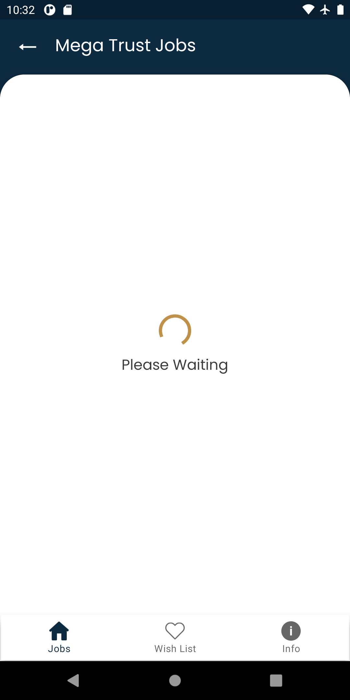
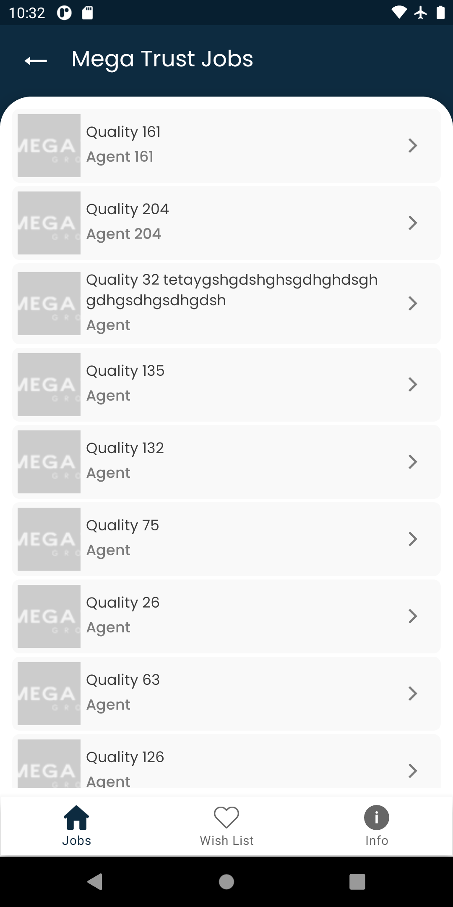
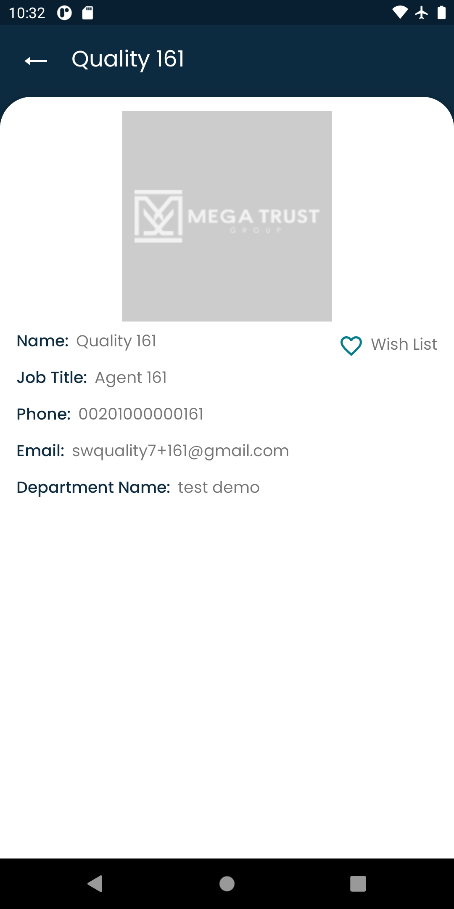
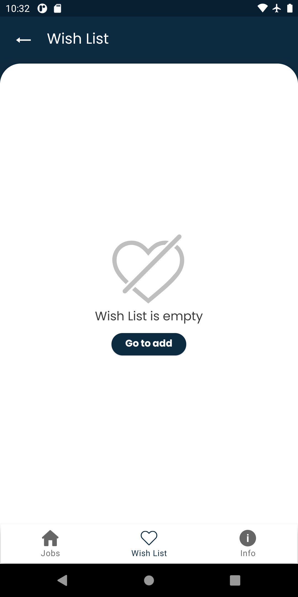
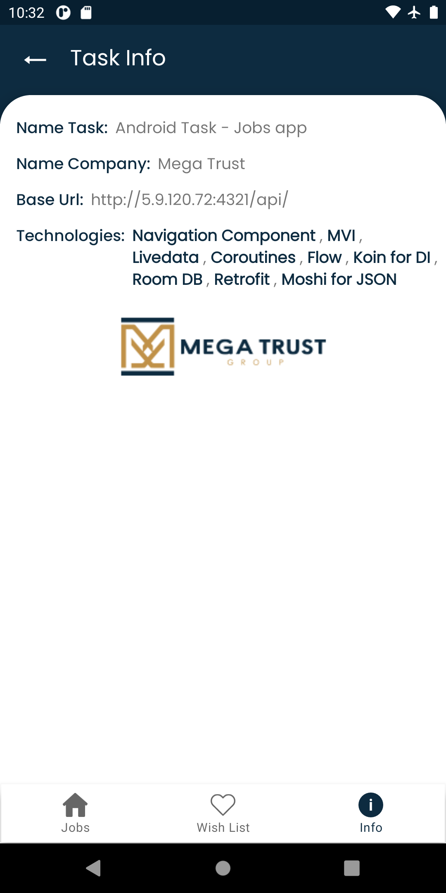

# MVI Architecture Design

## Coroutine + Flow = MVI :heart:
*   Play MVI with Kotlin Coroutines Flow.
*   Multiple modules, Clean Architecture.
*   Master branch using Koin for DI.
*   **Checkout [dagger_hilt branch](https://github.com/Kotlin-Android-Open-Source/MVI-Coroutines-Flow/tree/dagger_hilt), using Dagger Hilt for DI** (_obsolete_).
*   **[Download latest debug APK here](https://nightly.link/Kotlin-Android-Open-Source/MVI-Coroutines-Flow/workflows/build/master/app-debug.zip)**.

> **Jetpack Compose Version** 👉 https://github.com/Kotlin-Android-Open-Source/Jetpack-Compose-MVI-Coroutines-Flow

| Get Started | Loading View |
| --------------- | ---------------- |
|  |  |

| Recycler View | Details View  |
| ------------ | ------------ |
|  |  |

| WishList is Empty | Info Task  |
| ------------ | ------------ |
|  |  |

<!-- Pixel 3 XL API 30 -->
